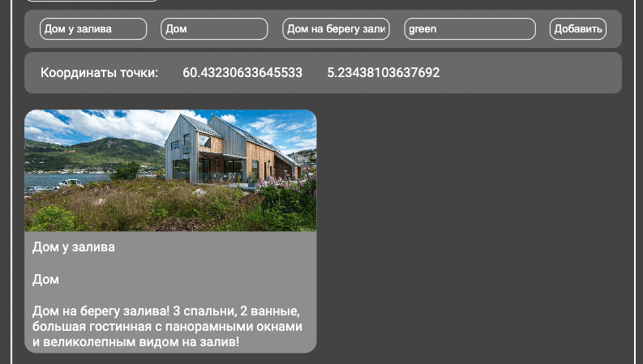
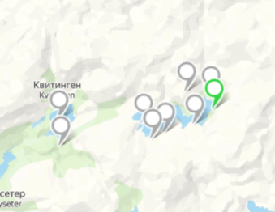
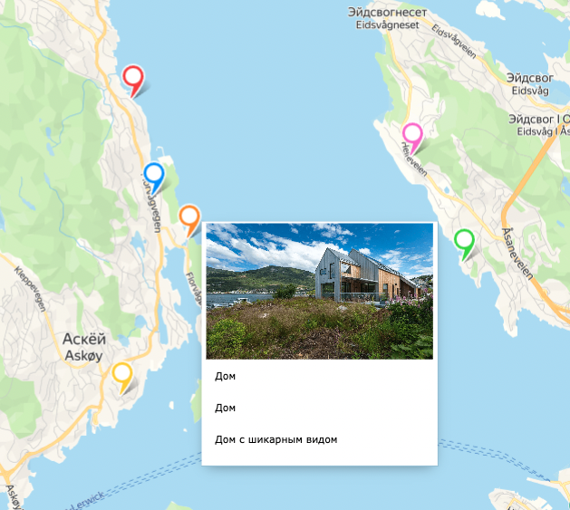

Получилось сделать все кроме фильтрации маркеров, но на это есть причины, которые я могу объяснить! 

Что бы я не делал, все время упирался в тупиковую ситуацию, из которой нельзя было выйти из за кривоватого API!

А теперь по порядку: 

1. Так как я юзал Яндекс Карты, то у меня было два варианта для создания коллекции из маркеров, это через geoObjects или через objectManager!

2. У objectManager отсутствует опция перетаскивая маркера, поэтому я выбрал первый вариант с geoObjects.

3. Но не всегда все идет по плану! И сделав все задания на geoObjects, я узнаю, что в отличии от objectManager, у geoObjects нет функции фильтрации <h2>🤡</h2> вот такой замкнутый круг, попытался написать свою функцию для фильтрации маркеров, но не вышло.

4. Так же стоило добавить возможность добавления картинки, но подумал, что в данном задании упор именно на маркеры, а не на добавлении картинок)

<h3><a href="https://map-with-markers-henna.vercel.app/">Ссылка на деплой</a></h3>

Порядок действий: 

1. Для начала требуется создать маркер. Заполнить все поля с данными!

2. После заполнения поля в списке появится новый объект! 

;

3. В случае есть у вас множество объектов на карте и вам нужно найти интересующий вас объект, то достаточно кликнуть по карточке маркера в списке и вам покажет интересующий вас маркер!

4. Так же при наведение на маркер, у вас есть возможность узнать немного информации о том, что расположено в этом месте!

На данном скрине курсор наведен на оранжевый маркер.

 
